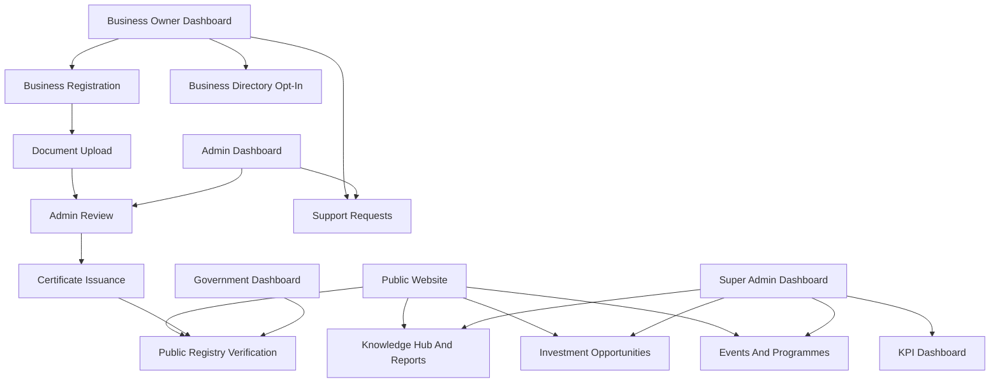

# N-BIDEA Platform Expansion - Plan

## Goal Capsule

| Field | Value |
|---|---|
| Objective | Evolve the current NB-CCI registration and verification portal into a fuller N-BIDEA digital platform for business formalization, certification, trade intelligence, investment promotion, content publishing, and ecosystem support. |
| Source authority | The attached 2026 Nigeria-Benin Business Outlook report is source material for domain direction. Existing Laravel code remains the authority for implementation patterns. |
| Execution profile | Phase-by-phase Laravel 13 implementation using Blade, Bootstrap, Form Requests, policies, route groups, Eloquent models, seeders, and PHPUnit feature tests. |
| Primary constraint | Ship in small useful increments. Do not replace the current working portal with a new SPA or unrelated design system. |
| Stop conditions | Stop before payment gateway integration, live third-party financial data, external identity verification, or public deployment unless those are separately approved. |

---

## Product Contract

### Summary

The current project already handles core portal operations: account registration, role dashboards, business CRUD, document upload, admin verification, renewals, fee tracking, government search, and audit logging.
The report expands that mission into a digital N-BIDEA platform with public trust, certification, B2B matchmaking, trade intelligence, advisory support, investment promotion, events, sector development, women and youth enterprise support, and KPI monitoring.
This plan keeps the existing Laravel MVC shape and builds the wider platform in phases.

### Problem Frame

The homepage currently presents a basic portal identity, while the report describes an institutional corridor platform.
The product should communicate the scale of the Nigeria-Benin opportunity and give each audience a clear path: register, verify, invest, learn, request support, or connect.
The back office should gain the data and workflows needed to support that public promise.

### Actors

- A1. Guest visitor wants to understand NB-CCI, N-BIDEA, AfCFTA opportunities, and how to participate.
- A2. Business owner wants to register, submit documents, get certified, renew certification, and find opportunities.
- A3. Admin wants to review applications, documents, renewals, fees, support requests, events, and published content.
- A4. Super admin wants to manage platform configuration, content, sectors, agencies, reports, users, KPIs, and institutional data.
- A5. Government official wants to verify businesses, record checks, and search trusted registry records.
- A6. Investor or partner wants to discover verified businesses, priority sectors, investment opportunities, reports, and events.

### Requirements

**Public Positioning**

- R1. The homepage must reposition the product as the N-BIDEA digital platform for Nigeria-Benin business integration, not only a login and registration portal.
- R2. The homepage must show report-aligned impact metrics: enterprise registration target, active digital users target, investment target, jobs target, formal trade growth target, and annual enterprise value.
- R3. The homepage must give first-screen actions for business registration, public business verification, investment opportunities, and report/resources discovery.
- R4. Public pages must explain NB-CCI, N-BIDEA, priority sectors, AfCFTA and ECOWAS support, business verification, advisory services, events, and contact pathways.

**Trust And Verification**

- R5. Approved businesses must receive a certificate record with a unique certificate number, expiry date, verification URL, and QR code payload.
- R6. Guests and government officials must be able to verify a business or certificate without exposing private documents.
- R7. Public verification results must show business name, registry number, status, sector, state/country presence, certificate validity, and last verification date.
- R8. Admin actions that approve, reject, expire, suspend, renew, or reissue certificates must be audit logged.

**Content And Knowledge Hub**

- R9. Super admins must manage public pages, blog posts, reports, publications, and resource categories from the dashboard.
- R10. Public visitors must browse blog posts and resources by category, sector, audience, and publication date.
- R11. Reports and publications must support uploaded PDF files, summaries, featured status, and download counts.
- R12. Content must support English-first publishing and leave room for French localization later.

**Trade Intelligence And Investment**

- R13. The platform must expose priority sectors and sector opportunity pages based on the report: agro-processing, logistics, pharmaceuticals, manufacturing, ICT, renewable energy, textiles, petrochemicals, tourism, and trade finance.
- R14. Verified businesses must be able to opt into a public or member-only directory profile.
- R15. Investors and partners must be able to browse investment opportunities by sector, country corridor, funding need, opportunity type, and readiness stage.
- R16. Admins must be able to review and approve directory listings and investment opportunities before publication.

**Support Services**

- R17. Business owners must be able to request trade advisory, legal referral, customs guidance, investment facilitation, consular support, and dispute referral.
- R18. Admins must triage support requests by category, status, priority, assigned user, and due date.
- R19. The system must keep a private note trail and public response trail for support requests.

**Events And Programmes**

- R20. Super admins must publish business forums, trade missions, SME academy sessions, sector working group meetings, and women/youth desk programmes.
- R21. Authenticated users must be able to register interest in events and programmes.
- R22. Admins must be able to export event registrations and update attendance status.

**Analytics And M&E**

- R23. Super admins must see a KPI dashboard that tracks report-aligned indicators: registrations, verified businesses, jobs supported, women-owned enterprises, youth-owned enterprises, investment mobilized, formal export value, processing times, certificate renewals, and support requests.
- R24. Admin dashboards must include processing-time metrics for business review, document review, renewals, fee confirmation, and support request resolution.
- R25. The system must preserve existing role boundaries and avoid exposing private business documents, payment proof, or admin notes publicly.

### Key Flows

- F1. Public discovery flow: a visitor lands on the homepage, reads the corridor value proposition, views impact metrics, chooses registration, verification, investment, resources, or contact.
- F2. Certification flow: a business owner submits a business and documents, an admin approves the business, the system creates or renews certificate data, and the business owner downloads the certificate.
- F3. Public verification flow: a visitor enters registry or certificate details, the system returns a limited public verification result, and the audit log records sensitive official checks where applicable.
- F4. Content flow: a super admin drafts a post or report, previews it, publishes it, and the public knowledge hub lists it under the correct category.
- F5. Matchmaking flow: a verified business opts into the directory, admins approve the profile, and investors browse or submit interest through a controlled contact form.
- F6. Support flow: a business owner opens an advisory request, admins triage it, internal notes stay private, and public responses notify the requester.
- F7. KPI flow: platform activity updates operational metrics, super admins filter dashboards by date range, sector, location, role, and status.

### Scope Boundaries

- Deferred for later: live payment gateway integration, automatic CAC/NIN/NRS verification APIs, AI-generated trade advice, real-time customs integrations, and public investment transactions.
- Outside this phase: replacing Blade with Inertia, building a mobile app, deploying production infrastructure, or redesigning every dashboard at once.
- Included now: public design, certificate data, verification, content management, directory, opportunities, support requests, events, and analytics foundations.

---

## Planning Contract

### Key Technical Decisions

- KTD1. Keep the app Blade-first and Bootstrap-based. The current views use `@extends`, Bootstrap CDN, Bootstrap Icons, and role-specific dashboard layouts, so the expansion should reuse those conventions before introducing new UI infrastructure.
- KTD2. Add modules using standard Laravel MVC folders. Use models in `app/Models`, controllers under role or domain folders in `app/Http/Controllers`, validation in `app/Http/Requests`, migrations in `database/migrations`, and views under `resources/views`.
- KTD3. Use Form Requests for new create and update screens. Existing code has mixed validation, but new feature-bearing admin and owner forms should follow the stronger existing pattern in `app/Http/Requests`.
- KTD4. Use policies for resource authorization and route middleware for role gates. Existing code registers policies and named gates in `app/Providers/AppServiceProvider.php` and applies role middleware in `routes/web.php`.
- KTD5. Store public content in database tables, not static Blade pages only. The plan requires admin-managed blogs, reports, events, opportunities, and public pages.
- KTD6. Implement certificate verification as first-party data. Do not depend on third-party identity verification until the business rules and public privacy surface are stable.
- KTD7. Store uploaded report PDFs and generated certificates on a configured disk. First fix or add the disk used for private documents because current controllers call `Storage::disk('private')` while `config/filesystems.php` does not define `private`.
- KTD8. Keep sensitive data out of public pages. Public verification and directory views must use explicit safe fields instead of dumping model relationships.

### High-Level Technical Design

### Existing Patterns To Follow

- Routes are grouped by role and named consistently in `routes/web.php`.
- Dashboard pages extend `resources/views/layouts/dashboard.blade.php`.
- Public and auth pages extend `resources/views/layouts/public.blade.php` or `resources/views/layouts/app.blade.php`.
- Business workflow controllers live under `app/Http/Controllers/Business`.
- Admin workflow controllers live under `app/Http/Controllers/Admin`.
- Super admin management controllers live under `app/Http/Controllers/SuperAdmin`.
- Business files and proofs already use storage through controller actions.
- Audit logging is centralized through `App\Services\AuditService`.

### Sequencing

1. Stabilize platform foundation and visual identity.
2. Ship public homepage and core public pages.
3. Ship certificate issuance and public verification.
4. Ship knowledge hub and report library.
5. Ship directory and investment opportunities.
6. Ship support services, events, and programme registration.
7. Ship KPI and operational analytics.
8. Harden security, tests, localization readiness, and deployment operations.

---

## Implementation Units

### U1. Foundation, Storage, And Navigation Baseline

- **Goal:** Fix platform basics and prepare shared navigation for the expanded public and dashboard surfaces.
- **Requirements:** R1, R3, R7, R25.
- **Files:** `config/filesystems.php`, `routes/web.php`, `resources/views/layouts/public.blade.php`, `resources/views/layouts/dashboard.blade.php`, `resources/views/layouts/app.blade.php`, `resources/css/app.css`.
- **Approach:** Add a configured `private` disk or update file-using controllers to a defined private disk. Add public navigation slots for About, N-BIDEA, Registry, Opportunities, Resources, Events, and Contact. Keep Bootstrap CDN unless a broader design rebuild is approved.
- **Test Scenarios:** Confirm private document upload and download use an existing disk. Confirm public pages can be routed without authentication. Confirm authenticated dashboard navigation still varies by user role.
- **Verification:** Run `php artisan test --compact`. Add feature tests in `tests/Feature/StorageAndNavigationTest.php`.

### U2. Homepage Redesign And Public Institutional Pages

- **Goal:** Rebuild the public homepage and core informational pages around the N-BIDEA strategic positioning.
- **Requirements:** R1, R2, R3, R4.
- **Files:** `app/Http/Controllers/Home/PublicController.php`, `routes/web.php`, `resources/views/home.blade.php`, `resources/views/public/about.blade.php`, `resources/views/public/n-bidea.blade.php`, `resources/views/public/priority-sectors.blade.php`, `resources/views/public/afcfta-ecowas.blade.php`, `resources/views/public/contact.blade.php`.
- **Approach:** Use report themes as page content: business formalization, digital platform, support services, policy advocacy, investment promotion, sector development, corridor opportunity, and KPI targets. Use deep green, red, yellow, and white as the institutional palette.
- **Test Scenarios:** Guests see the homepage. Homepage contains registration, verification, investment, and resources CTAs. Public pages return 200. Authenticated users can still reach dashboards through existing routes.
- **Verification:** Run `php artisan test --compact tests/Feature/PublicPagesTest.php`.

### U3. Certificate Issuance And Public Verification

- **Goal:** Add first-party certificate records and public verification pages for approved businesses.
- **Requirements:** R5, R6, R7, R8, R25.
- **Files:** `app/Models/Certificate.php`, `app/Policies/CertificatePolicy.php`, `app/Http/Controllers/Certificate/CertificateController.php`, `app/Http/Controllers/Home/VerificationController.php`, `app/Services/CertificateNumberService.php`, `database/migrations/*_create_certificates_table.php`, `resources/views/certificates/show.blade.php`, `resources/views/public/verify.blade.php`, `resources/views/public/verification-result.blade.php`, `routes/web.php`.
- **Approach:** Create one active certificate per approved business unless reissued. Generate certificate numbers using a dedicated service similar to `RegistryNumberService`. Add `verification_code`, `issued_at`, `expires_at`, `revoked_at`, and `status`. Use a QR payload that points to the public verification route.
- **Test Scenarios:** Approving a business creates a certificate. Renewing a business extends or reissues certificate validity. Public verification finds a valid certificate by certificate number, registry number, or verification code. Public verification hides private documents and admin notes. Revoked or expired certificates show an appropriate limited result.
- **Verification:** Run `php artisan test --compact tests/Feature/CertificateVerificationTest.php`.

### U4. Knowledge Hub, Blog, Reports, And Publications

- **Goal:** Add a content system for reports, articles, sector briefs, policy updates, and downloadable PDFs.
- **Requirements:** R9, R10, R11, R12.
- **Files:** `app/Models/Post.php`, `app/Models/ContentCategory.php`, `app/Models/Publication.php`, `app/Http/Controllers/Home/KnowledgeHubController.php`, `app/Http/Controllers/SuperAdmin/SuperAdminPostController.php`, `app/Http/Controllers/SuperAdmin/SuperAdminPublicationController.php`, `app/Http/Requests/PostRequest.php`, `app/Http/Requests/PublicationRequest.php`, `database/migrations/*_create_content_categories_table.php`, `database/migrations/*_create_posts_table.php`, `database/migrations/*_create_publications_table.php`, `database/seeders/ContentCategorySeeder.php`, `resources/views/public/blog/*.blade.php`, `resources/views/public/reports/*.blade.php`, `resources/views/super-admin/posts/*.blade.php`, `resources/views/super-admin/publications/*.blade.php`, `routes/web.php`.
- **Approach:** Support draft and published states, slugs, excerpt, body, featured image path, audience, sector, published date, and download count. Seed categories such as Corridor Intelligence, AfCFTA Guides, Export Readiness, Customs and Compliance, Investment Opportunities, Sector Briefs, Policy Updates, Women and Youth Enterprise, and Trade Missions.
- **Test Scenarios:** Guests see only published posts and publications. Super admins can create, edit, publish, unpublish, and delete content. Slugs are unique. Publication download increments count without exposing private storage paths.
- **Verification:** Run `php artisan test --compact tests/Feature/KnowledgeHubTest.php`.

### U5. Business Directory And B2B Matchmaking

- **Goal:** Let verified businesses opt into discoverable profiles and let partners submit controlled interest requests.
- **Requirements:** R14, R15, R16, R25.
- **Files:** `app/Models/BusinessProfile.php`, `app/Models/BusinessInquiry.php`, `app/Http/Controllers/Business/BusinessProfileController.php`, `app/Http/Controllers/Home/BusinessDirectoryController.php`, `app/Http/Controllers/Admin/AdminBusinessProfileController.php`, `app/Http/Requests/BusinessProfileRequest.php`, `app/Http/Requests/BusinessInquiryRequest.php`, `database/migrations/*_create_business_profiles_table.php`, `database/migrations/*_create_business_inquiries_table.php`, `resources/views/business/profile/*.blade.php`, `resources/views/public/directory/*.blade.php`, `resources/views/admin/business-profiles/*.blade.php`, `routes/web.php`.
- **Approach:** Use an opt-in profile separate from the private `businesses` table fields. Include safe public data: sector, services, operating locations, trade interests, certifications, website, and contact preference. Require admin approval before publication.
- **Test Scenarios:** Unverified businesses cannot publish directory profiles. Business owners can create and submit a profile for their own verified business. Admins can approve or reject profiles. Guests can browse approved profiles. Inquiries are recorded without exposing private owner email unless approved.
- **Verification:** Run `php artisan test --compact tests/Feature/BusinessDirectoryTest.php`.

### U6. Investment Opportunities And Sector Pages

- **Goal:** Add structured opportunity listings and richer public sector pages.
- **Requirements:** R13, R15, R16.
- **Files:** `app/Models/InvestmentOpportunity.php`, `app/Http/Controllers/Home/InvestmentOpportunityController.php`, `app/Http/Controllers/SuperAdmin/SuperAdminInvestmentOpportunityController.php`, `app/Http/Requests/InvestmentOpportunityRequest.php`, `database/migrations/*_create_investment_opportunities_table.php`, `resources/views/public/opportunities/*.blade.php`, `resources/views/super-admin/opportunities/*.blade.php`, `resources/views/public/priority-sectors/*.blade.php`, `routes/web.php`.
- **Approach:** Model opportunity type, sector, corridor direction, funding range, readiness stage, summary, risk notes, contact channel, status, and featured flag. Link opportunities to sectors where possible.
- **Test Scenarios:** Guests can filter published opportunities. Super admins can manage opportunities. Draft opportunities are hidden. Featured opportunities appear on the homepage. Sector pages show related opportunities and knowledge hub content.
- **Verification:** Run `php artisan test --compact tests/Feature/InvestmentOpportunitiesTest.php`.

### U7. Trade Advisory And Support Request Module

- **Goal:** Add support workflows for advisory, legal referral, customs guidance, investment facilitation, consular support, and dispute referral.
- **Requirements:** R17, R18, R19, R25.
- **Files:** `app/Models/SupportRequest.php`, `app/Models/SupportRequestMessage.php`, `app/Policies/SupportRequestPolicy.php`, `app/Http/Controllers/Business/SupportRequestController.php`, `app/Http/Controllers/Admin/AdminSupportRequestController.php`, `app/Http/Requests/SupportRequestStoreRequest.php`, `app/Http/Requests/SupportRequestUpdateRequest.php`, `database/migrations/*_create_support_requests_table.php`, `database/migrations/*_create_support_request_messages_table.php`, `resources/views/business/support/*.blade.php`, `resources/views/admin/support/*.blade.php`, `routes/web.php`.
- **Approach:** Track category, priority, status, assigned user, due date, related business, private notes, public responses, and attachments if needed. Keep audit logging on status and assignment changes.
- **Test Scenarios:** Business owners can create support requests for their own businesses. Admins can see and assign requests. Private notes are not visible to business owners. Public responses are visible to request owners. Role boundaries are enforced.
- **Verification:** Run `php artisan test --compact tests/Feature/SupportRequestsTest.php`.

### U8. Events, Forums, Trade Missions, And Programme Registration

- **Goal:** Add event publishing and registration for NB-CCI forums, trade missions, SME academy, sector groups, and women/youth programmes.
- **Requirements:** R20, R21, R22.
- **Files:** `app/Models/Event.php`, `app/Models/EventRegistration.php`, `app/Http/Controllers/Home/EventController.php`, `app/Http/Controllers/SuperAdmin/SuperAdminEventController.php`, `app/Http/Controllers/Admin/AdminEventRegistrationController.php`, `app/Http/Requests/EventRequest.php`, `database/migrations/*_create_events_table.php`, `database/migrations/*_create_event_registrations_table.php`, `resources/views/public/events/*.blade.php`, `resources/views/super-admin/events/*.blade.php`, `resources/views/admin/events/*.blade.php`, `routes/web.php`.
- **Approach:** Support event type, location, country, date range, capacity, registration deadline, status, and audience. Authenticated users register interest. Admins update attendance and export registration lists.
- **Test Scenarios:** Guests can browse published events. Authenticated users can register once. Capacity and registration deadline are enforced. Admins can view and update registrations. Draft events are hidden.
- **Verification:** Run `php artisan test --compact tests/Feature/EventsTest.php`.

### U9. KPI Dashboard And Operational Analytics

- **Goal:** Add report-aligned metrics and admin operational dashboards.
- **Requirements:** R23, R24, R25.
- **Files:** `app/Http/Controllers/SuperAdmin/SuperAdminKpiDashboardController.php`, `app/Http/Controllers/Admin/AdminOperationsDashboardController.php`, `app/Models/KpiSnapshot.php`, `database/migrations/*_create_kpi_snapshots_table.php`, `resources/views/super-admin/kpis/index.blade.php`, `resources/views/admin/operations/index.blade.php`, `routes/web.php`.
- **Approach:** Start with live aggregate metrics from existing tables, then optionally add periodic snapshots. Include registration counts, verified counts, document processing counts, renewal counts, support counts, publication downloads, directory profiles, opportunities, event registrations, and processing times.
- **Test Scenarios:** Super admins can access KPI dashboards. Non-super admins cannot access super admin KPIs. Date filters change totals. Metrics do not expose private records. Admin operational metrics respect role access.
- **Verification:** Run `php artisan test --compact tests/Feature/KpiDashboardTest.php`.

### U10. Localization, Hardening, And Release Readiness

- **Goal:** Harden the expanded platform for maintainability, security, and future bilingual support.
- **Requirements:** R12, R25.
- **Files:** `lang/en/*.php`, `lang/fr/*.php`, `app/Providers/AppServiceProvider.php`, `app/Http/Middleware/*`, `tests/Feature/*`, `README.md` if documentation updates are requested.
- **Approach:** Introduce translation keys for new public content labels and core workflow messages. Keep long article/report bodies database-managed. Add missing policies for new models. Add route tests for role access. Add indexing to new tables for filters.
- **Test Scenarios:** Unauthorized users cannot access admin screens. Public pages do not expose private fields. New routes have named routes. Validation errors return correctly. Optional French labels can be loaded without changing templates.
- **Verification:** Run `php artisan test --compact` and `vendor/bin/pint --dirty --format agent` after PHP changes.

---

## Verification Contract

| Gate | Command | Applies To | Done Signal |
|---|---|---|---|
| Baseline suite | `php artisan test --compact` | All phases | The existing and new tests pass. |
| Phase feature tests | `php artisan test --compact tests/Feature/<FeatureTest>.php` | Each implementation unit | The unit's feature tests pass before moving to the next unit. |
| Formatting | `vendor/bin/pint --dirty --format agent` | Any PHP edit | Pint reports no remaining dirty formatting changes. |
| Route integrity | `php artisan route:list --except-vendor` | Route changes | New routes are named, grouped, and protected as planned. |
| Migration check | `php artisan migrate:fresh --seed --no-interaction` | New tables or seeders | Schema builds cleanly and seeders run. Use a safe local/test database only. |
| Browser smoke | Manual or browser automation against `/`, `/verify`, `/blog`, `/reports`, `/opportunities`, `/events` | Public UI phases | Pages render without layout breaks, route errors, or console errors. |

---

## Definition of Done

- The public homepage presents N-BIDEA as a strategic corridor platform with clear CTAs.
- Public pages exist for NB-CCI, N-BIDEA, priority sectors, AfCFTA and ECOWAS resources, verification, knowledge hub, reports, opportunities, events, and contact.
- Certificate issuance and public verification work without exposing private documents.
- Super admins can manage posts, publications, opportunities, and events.
- Verified businesses can opt into a directory profile, and admins can approve listings.
- Business owners can open support requests, and admins can triage and respond.
- KPI dashboards report platform activity and operational processing metrics.
- Role and policy boundaries are covered by tests.
- New database tables include useful indexes for filters and status screens.
- Audit logs cover certificate, verification, support, directory, and publication state changes where relevant.
- The full test suite passes.
- PHP formatting has been applied with Pint.
- Temporary exploration files are removed unless they are intentionally retained as project artifacts.

---

## Appendix

### Recommended Blog Categories

| Category | Purpose |
|---|---|
| Corridor Intelligence | Trade flow updates, market analysis, and corridor performance. |
| AfCFTA Guides | Rules of Origin, ETLS, and cross-border compliance explainers. |
| Export Readiness | Practical preparation guides for SMEs. |
| Customs And Compliance | Border, documentation, and regulatory guidance. |
| Investment Opportunities | Sector and funding opportunity articles. |
| Sector Briefs | Agro-processing, logistics, pharmaceuticals, manufacturing, ICT, renewable energy, and tourism updates. |
| Policy Updates | Institutional and regulatory developments. |
| Women And Youth Enterprise | Inclusive trade participation, financing, and mentorship. |
| Trade Missions And Events | Forums, missions, academy sessions, and working groups. |

### Suggested Phase Order For Delivery

| Phase | Name | Primary Outcome |
|---|---|---|
| Phase 1 | Foundation and Homepage | Platform identity, storage fix, public navigation, core public pages. |
| Phase 2 | Certification and Verification | Digital certificates, QR verification, safe public registry. |
| Phase 3 | Knowledge Hub | Blog, reports, publications, resource categories. |
| Phase 4 | Directory and Opportunities | B2B profiles, matchmaking inquiries, investment opportunity listings. |
| Phase 5 | Support Services and Events | Advisory desk, support workflow, forums, trade missions, programme registrations. |
| Phase 6 | KPI and Analytics | M&E dashboard, operational metrics, snapshots, exports. |
| Phase 7 | Hardening and Localization | French-readiness, policy coverage, tests, browser QA, release cleanup. |
